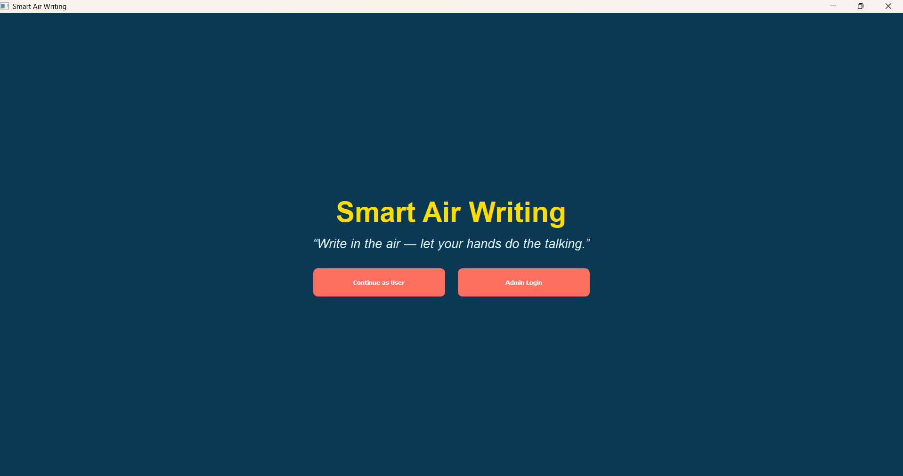
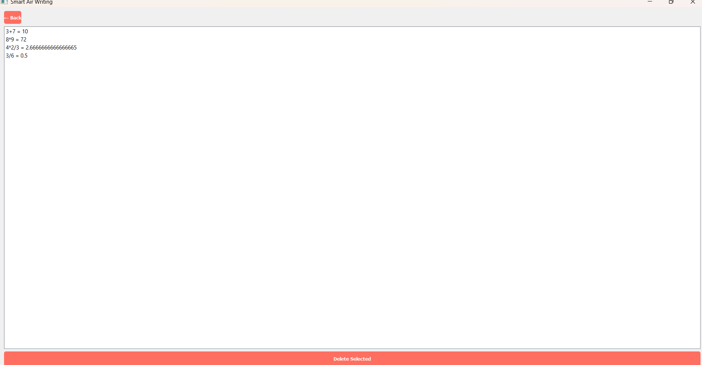
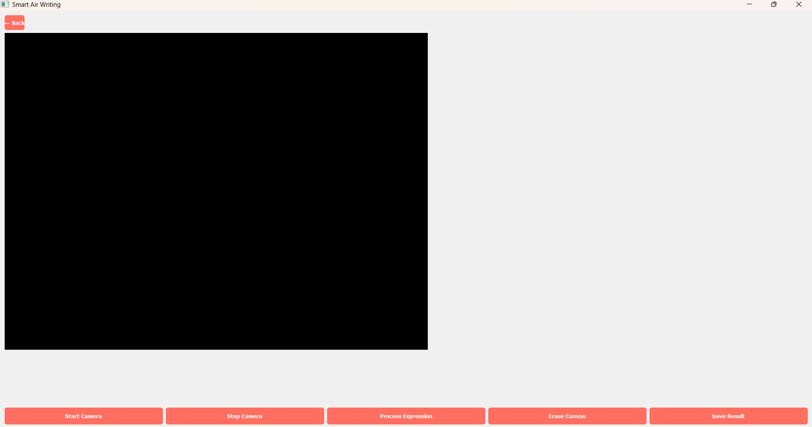
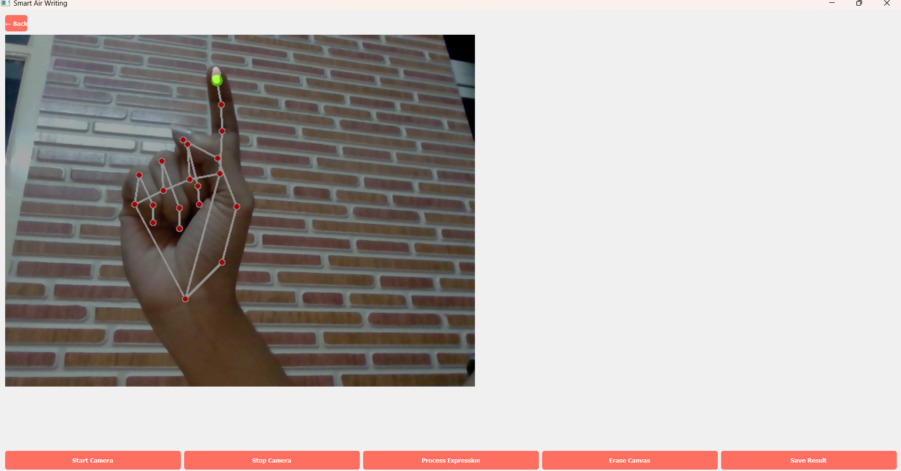
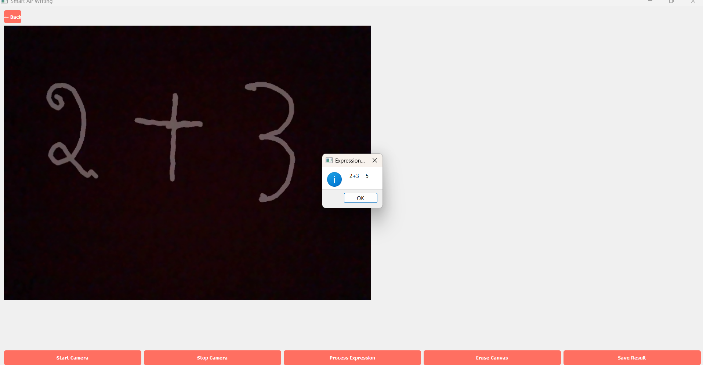

# ✍️ Smart Air Writing Recognition System

## 📌 Overview
This project allows users to write in the air using hand gestures captured through a webcam. It uses computer vision to track finger movement and display writing on screen.

## ⚙️ Technologies Used
- Python
- OpenCV
- MediaPipe
- NumPy

## 🚀 How to Run

1. Clone the repository:
git clone https://github.com/gagana-v2004/smart-air-writing.git

2. Go to project folder:
cd smart-air-writing

3. Install dependencies:
pip install -r requirements.txt

4. Run the program:
python main.py

## 📸 Screenshots

### Login Page

### Admin Page

### User Login

### Hand Tracking

### Writing Output

## 🎯 Features
- Real-time hand tracking
- Air writing detection
- User-friendly interface
